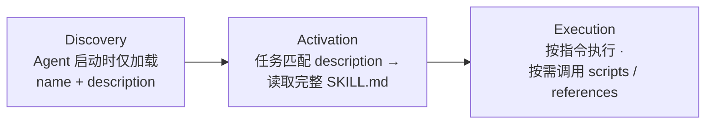
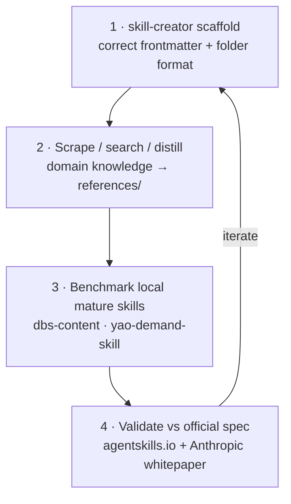

<div align="center">

# 🧩 SHR Skills

**A personal collection of production-grade Agent Skills — workflow + distilled experience, not just code generators.**

> 🧑‍💻 **Owner：SHR（lyanshi795）** — 这是我的名字缩写。仓库里所有技能均为我个人创建并维护。
> 以后新增的 skills 都上传到这里，统一归入 **SHR Skills** 合集，并在每个 `SKILL.md` 标注 `author: SHR` + `collection: SHR Skills`。

Built against the [Anthropic Agent Skills](https://agentskills.io) open standard · MIT licensed · cross-runtime compatible

<br>

[](https://github.com/lyanshi795-commits/ai-skills-lab/stargazers)
[](https://github.com/lyanshi795-commits/ai-skills-lab/network/members)
[](https://github.com/lyanshi795-commits)
[](./LICENSE)
[](https://github.com/lyanshi795-commits/ai-skills-lab/commits/main)
[](./skills)
[](https://agentskills.io/specification)
[](https://github.com/lyanshi795-commits/ai-skills-lab)

</div>

---

## 📖 What are Agent Skills?

> **Agent Skills** are a lightweight, open format for extending AI agents with specialized knowledge and workflows. At its core, a skill is a **folder containing a `SKILL.md` file** — metadata (`name`, `description`) plus instructions that tell an agent *how* to perform a task. Skills may also bundle `scripts/`, `references/`, and `assets/`.

This collection follows the [Anthropic Agent Skills specification](https://agentskills.io/specification): each skill is **self-contained, version-controlled, and loaded on demand** through *progressive disclosure*.



Because full instructions load **only when a task calls for them**, an agent can keep many skills on hand with a tiny context footprint — exactly the design the spec intends.

---

## ✨ Why this collection

| | This repo | Naïve "prompt dumps" |
|---|-----------|----------------------|
| **Structure** | Spec-compliant folders (`SKILL.md` + `scripts/` + `references/`) | Loose `.md` files |
| **Loading model** | Progressive disclosure (metadata → body → resources) | Everything dumped into context |
| **Provenance** | Every skill built via a benchmarked 4-step loop | Ad-hoc |
| **Benchmarked against** | Official Anthropic whitepaper + `agentskills.io` + mature skills (`dbs-content`, `yao-demand-skill`) | — |
| **License** | MIT, explicit `license`/`allowed-tools` frontmatter | Unspecified |
| **Tested** | Scripts runnable; JSON-validated outputs | Untested |

In short: these are **workflow + experience-distillation** skills (the Anthropic / OpenAI sense), not code generators.

---

## 📑 Table of Contents

- [What are Agent Skills?](#-what-are-agent-skills)
- [Why this collection](#-why-this-collection)
- [Skill catalog](#-skill-catalog)
- [Compatibility matrix](#-compatibility-matrix)
- [Installation](#-installation)
- [Repository structure](#-repository-structure)
- [Anatomy of a skill](#-anatomy-of-a-skill)
- [Design methodology](#-design-methodology)
- [Standards compliance](#-standards-compliance)
- [Contributing](#-contributing)
- [Roadmap](#-roadmap)
- [License & third-party notice](#-license--third-party-notice)
- [Acknowledgments](#-acknowledgments)

---

## 🗂️ Skill catalog

| # | Skill | Category | One-line | Trigger |
|---|-------|----------|----------|---------|
| 1 | `long-screenshot-ocr` | Vision / OCR | High-quality text extraction from ultra-long screenshots | 「OCR 这张截图」「把长图转成文字」 |
| 2 | `miniprogram-builder` | WeChat / No-code | Zero-to-one WeChat mini-program workflow + experience cards | `/miniprogram-builder`、「帮我做个小程序」 |
| 3 | `skill-building-playbook` | Meta-skill | How to build/review Agent Skills, benchmarked | `/skill-building-playbook`、「帮我做个 skill」 |
| 4 | `gzh-cover-maker` | WeChat / Design | Hook-driven WeChat cover images (square + wide) | 「公众号封面」「文章封面」 |
| 5 | `gzh-infographic-maker` | WeChat / Design | Premium two-column comparison infographics | 「公众号对比图」「双栏对比图」 |
| 6 | `repo-topic-pipeline` | Content / Research | Repo → topic library → ranked topic decision table | 「把仓库变成选题库」「选题打分」 |

### 1. 🔍 `long-screenshot-ocr` — Ultra-long screenshot OCR

- **What it does**: Splits a tall screenshot into overlapping slices, upscales each, runs RapidOCR (PP-OCR), rebuilds reading order, and cleans noise (page numbers, console timestamps, edge artifacts). Solves whole-image OCR's missing titles, scrambled order, and digit noise.
- **Dependencies**: `pip install rapidocr-onnxruntime pillow numpy`
- **Usage**:
  ```bash
  python skills/long-screenshot-ocr/scripts/ocr_long_screenshot.py <image.png> <output.md>
  ```
- **Inside**: `SKILL.md`, `scripts/ocr_long_screenshot.py`

### 2. 💬 `miniprogram-builder` — WeChat mini-program, zero to one

- **What it does**: A workflow + experience-decision cards. Turns a vague idea into a shippable WeChat mini-program: topic decision (5 cards A–E) → filing/entity/category selection → optional skeleton generation → launch runbook. Bundles a distilled "AI Mini-Program Field Manual" + WeChat service-category table.
- **Dependencies**: optional `scripts/generate_miniprogram.py` needs Python 3 (generates valid skeletons: calculator / score / quiz / generator / custom).
- **Usage**: invoke the skill in chat, advance through Phases 0–7; run the generator when a skeleton is needed.
- **Inside**: `SKILL.md`, `references/manual_synthesis.md`, `references/wechat_service_categories.md`, `scripts/generate_miniprogram.py`, `_demo/` (generated samples)

### 3. 📐 `skill-building-playbook` — Meta-skill for authoring skills

- **What it does**: Codifies *how to build a good skill* into a reusable loop — `skill-creator` scaffold → scrape/search distillation → benchmark local mature skills (`dbs-content`, `yao-demand-skill`) → validate against the official Anthropic spec. The methodology this whole repo is built on.
- **Dependencies**: none (pure methodology + references).
- **Usage**: invoke in chat; deep spec in `references/agent-skills-official-spec.md`.
- **Inside**: `SKILL.md`, `references/agent-skills-official-spec.md`

### 4. 🖼️ `gzh-cover-maker` — WeChat cover image generator

- **What it does**: Turns an article hook into two ready-to-use PNGs — **1080×1080 square** (feed thumbnail) + **1080×460 wide** (article top / share card). Premium dark + gold palette, large numeric/keyword anchor, 5-element task chips.
- **Dependencies**: `pip install pillow` + a Chinese system font (Microsoft YaHei / Source Han Sans).
- **Usage**: invoke the skill in chat; scripts in `scripts/`.
- **Inside**: `SKILL.md`, `scripts/gzh_cover.py`, `scripts/gzh_cover_膝盖篇.py`

### 5. 📊 `gzh-infographic-maker` — WeChat comparison infographic

- **What it does**: Generates 1080px-wide two-column comparison infographics. Restrained, premium look: near-black ink + warm gold + muted red (for the "before" side), rounded cards, bottom summary bar. Avoids font-glyph check/cross markers.
- **Dependencies**: `pip install pillow` + Chinese font.
- **Usage**: invoke the skill in chat; script in `scripts/gzh_infographic.py`.
- **Inside**: `SKILL.md`, `scripts/gzh_infographic.py`

### 6. 🧠 `repo-topic-pipeline` — Repo → topic library → decision table

- **What it does**: Converts any GitHub repo (or local docs/code folder) into a structured, searchable material library, then runs a 4-stage pipeline → ranked topic decision table: ① Collect ② Mine (multi-angle) ③ Score (5 dimensions, local tool) ④ Classify (Markdown + CSV).
- **Dependencies**: Python 3 (transparent local scoring tool).
- **Usage**: invoke the skill in chat; scripts `extract_materials.py`, `score_topics.py`.
- **Inside**: `SKILL.md`, `scripts/extract_materials.py`, `scripts/score_topics.py`

---

## 🔌 Compatibility matrix

These skills follow the `agentskills.io` open standard, so they load in any compliant runtime. Copy a skill folder into the corresponding global path:

| Runtime | Global skill path |
|---------|-------------------|
| **WorkBuddy** | `~/.workbuddy/skills/<skill-name>` |
| Claude Code | `~/.claude/skills/<skill-name>` |
| Codex | `~/.codex/skills/<skill-name>` |
| Cursor | `~/.cursor/skills/<skill-name>` |
| Gemini CLI | `~/.gemini/skills/<skill-name>` |
| GitHub Copilot | `~/.copilot/skills/<skill-name>` |
| OpenCode | `~/.config/opencode/skills/<skill-name>` |

> Project-scoped install: copy into `<your-project>/.workbuddy/skills/<skill-name>` (WorkBuddy) or the equivalent `.skills/` dir for other runtimes.

---

## ⚡ Installation

### Option A — Clone the whole repo (recommended)

```bash
git clone https://github.com/lyanshi795-commits/ai-skills-lab.git
```

Then copy the skills you need:

```bash
# user-wide (all projects)
cp -r ai-skills-lab/skills/<skill-name> ~/.workbuddy/skills/<skill-name>

# or project-scoped
cp -r ai-skills-lab/skills/<skill-name> <your-project>/.workbuddy/skills/<skill-name>
```

### Option B — Download a single skill

From the GitHub file browser, open `skills/<skill-name>/`, download the folder, and drop it into your skill directory. No build step, no network calls at runtime.

> After install, call a skill in chat with its trigger phrase or `/<skill-name>`. Rescan/restart the agent if it doesn't appear immediately.

---

## 📂 Repository structure

```
ai-skills-lab/
├── README.md
├── LICENSE
├── .gitignore
└── skills/
    ├── long-screenshot-ocr/        # 🔍 ultra-long screenshot OCR
    │   ├── SKILL.md
    │   └── scripts/ocr_long_screenshot.py
    ├── miniprogram-builder/        # 💬 WeChat mini-program zero→one
    │   ├── SKILL.md
    │   ├── references/{manual_synthesis,wechat_service_categories}.md
    │   ├── scripts/generate_miniprogram.py
    │   └── _demo/                   # generated skeletons
    ├── skill-building-playbook/     # 📐 meta-skill: how to build skills
    │   ├── SKILL.md
    │   └── references/agent-skills-official-spec.md
    ├── gzh-cover-maker/             # 🖼️ WeChat cover images
    │   ├── SKILL.md
    │   └── scripts/{gzh_cover,gzh_cover_膝盖篇}.py
    ├── gzh-infographic-maker/       # 📊 comparison infographics
    │   ├── SKILL.md
    │   └── scripts/gzh_infographic.py
    └── repo-topic-pipeline/         # 🧠 repo → topic decision table
        ├── SKILL.md
        └── scripts/{extract_materials,score_topics}.py
```

---

## 🧬 Anatomy of a skill

Every skill here is a folder + `SKILL.md`. The minimal valid form (from the official spec) needs only `name` and `description`:

```yaml
---
name: my-skill-name
description: What the skill does and when to use it.
---

# My Skill

Instructions the agent follows when this skill is active.
```

A production skill in this repo adds discipline — real example from `long-screenshot-ocr`:

```yaml
---
name: long-screenshot-ocr
description: Extract Chinese/English text from very long screenshot images
  (e.g., mobile scroll captures, course handbooks, chat logs) using slicing,
  upscaling, reading-order reconstruction and noise cleanup. Use this skill when
  the user asks to OCR or extract text from one or more PNG/JPG screenshots.
agent_created: true
---
```

**Frontmatter rules we enforce** (per `agentskills.io` + Anthropic whitepaper):
- `name` — kebab-case, ≤ 64 chars, matches the folder name, no reserved prefixes (`claude`, `anthropic`).
- `description` — must answer **what** + **when** + trigger words, ≤ 1024 chars.
- `license` / `allowed-tools` / `metadata` — declared where relevant (see [compliance](#-standards-compliance)).
- **Body** kept under ~500 lines; long material sinks into `references/`.

---

## 🛠️ Design methodology

Every skill in this repo was built through a benchmarked 4-step loop (no step skipped):



**Hard constraints we hold** (from the official sources):
- Progressive disclosure: metadata always resident · body on activation · `references/`/`scripts/` zero-token until needed.
- `SKILL.md` body < 500 lines.
- No `README.md` inside a skill folder (the spec reserves that name).
- **Security**: community skills have a ~26.1% vulnerability rate, and scripted skills are 2.12× riskier than instruction-only — so we audit every bundled file and only trust first-party sources.

---

## ✅ Standards compliance

| Skill | `license` | `allowed-tools` | `metadata.version` | `references/` | `scripts/` |
|-------|:---:|:---:|:---:|:---:|:---:|
| `long-screenshot-ocr` | — | — | — | — | ✅ |
| `miniprogram-builder` | MIT | ✅ | 1.0.0 | 2 | ✅ |
| `skill-building-playbook` | MIT | ✅ | 1.0.0 | 1 | — |
| `gzh-cover-maker` | — | — | — | — | ✅ |
| `gzh-infographic-maker` | — | — | — | — | ✅ |
| `repo-topic-pipeline` | — | — | — | — | ✅ |

> The **whole repo is MIT** (see [LICENSE](./LICENSE)); the per-skill `license` field is additionally declared on skills where it was set at authoring time. All skills are first-party (`agent_created: true`).

---

## 🤝 Contributing

Contributions are welcome. To keep the bar consistent with the methodology above:

1. **Fork** the repo and create a branch (`git checkout -b feature/my-skill`).
2. **Build** the skill via the [4-step loop](#-design-methodology): scaffold → distill → benchmark → validate.
3. **Verify** `SKILL.md` body < 500 lines, frontmatter complete, and any script runs cleanly.
4. **Commit** (`git commit -m "feat: add <skill-name>"`) and **push**.
5. Open a **Pull Request** describing the skill's trigger, inputs, and outputs.

Please read [CONTRIBUTING.md](./CONTRIBUTING.md) for the full checklist (or see the template below). New skills should follow the [Anatomy](#-anatomy-of-a-skill) section.

<details>
<summary>Minimal CONTRIBUTING.md template</summary>

```markdown
# Contributing

1. Fork → branch `feature/<name>`
2. Create `skills/<name>/SKILL.md` (kebab-case, matches folder)
3. Frontmatter: name + description(what+when+triggers) required;
   license / allowed-tools / metadata recommended
4. Body < 500 lines; long material → references/
5. Test any bundled script; audit for secrets
6. PR with trigger / inputs / outputs documented
```

</details>

---

## 🗺️ Roadmap

- [ ] Run `skills-ref validate` against every skill and publish a compliance badge.
- [ ] Add per-skill example outputs (sample OCR result, sample cover PNG) as visual proof.
- [ ] English docs for `miniprogram-builder` and `repo-topic-pipeline`.
- [ ] A GitHub Action that lints every `SKILL.md` on PR (frontmatter + line count).
- [ ] More meta-skills (e.g., a skill for *evaluating* other skills).

---

## 📄 License & third-party notice

This project is released under the **MIT License** — see [LICENSE](./LICENSE).

> ⚠️ **Scope**: this repository contains **only first-party skills** (`agent_created: true`). Third-party skills installed locally (`dbs-*`, `yao-*`, marketplace `skill_*`) are **not** included — their copyright belongs to their respective authors.

---

## 🙏 Acknowledgments

- The [Agent Skills specification](https://agentskills.io) and Anthropic's *The Complete Guide to Building Skills for Claude* — the format and constraints this repo follows.
- [awesome-claude-skills](https://github.com/ThojoUno/awesome-claude-skills) — for the compatibility-matrix and catalog conventions adopted here.
- `dbs-content` and `yao-demand-skill` — the local mature skills used as structural benchmarks (philosophy → phases → anti-patterns → output contract → reference map).
- arXiv 2602.12430 (survey) and 2602.20867 (SoK) — empirical backing for the progressive-disclosure and security guidance.

---

<div align="center">

**⭐ If this collection saves you time, consider starring the repo.**

</div>
